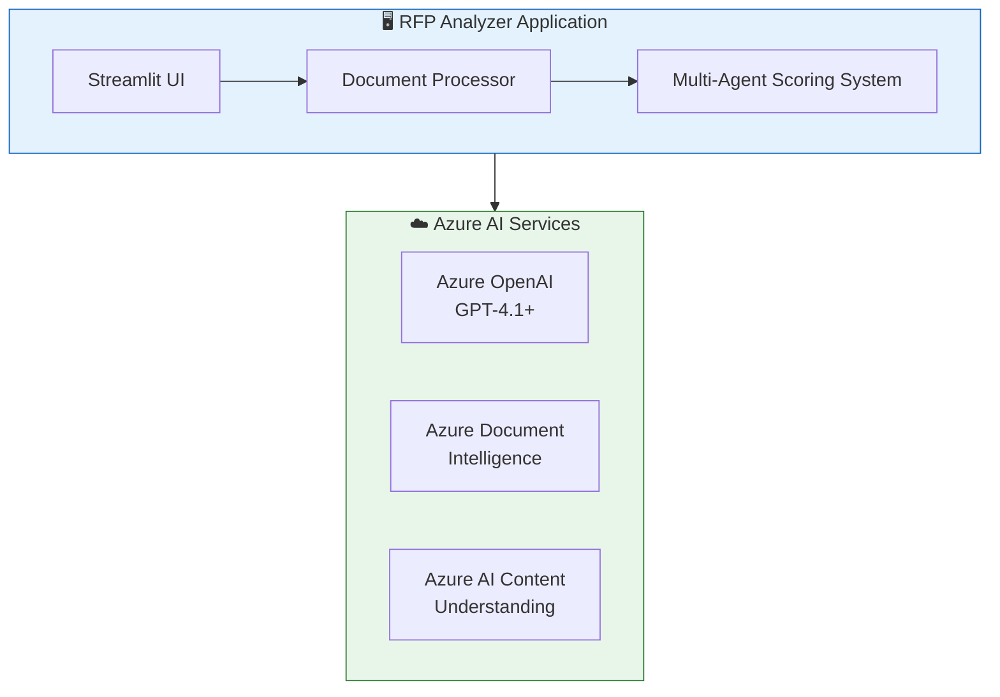

# RFP Analyzer

[](https://opensource.org/licenses/MIT)
[](https://www.python.org/downloads/)
[](https://azure.microsoft.com)

An AI-powered application for analyzing Request for Proposals (RFPs) and scoring vendor proposals using Azure AI services and a multi-agent architecture.

## 🎯 Overview

RFP Analyzer automates the complex process of evaluating vendor proposals against RFP requirements. It leverages Azure AI services to extract document content, analyze evaluation criteria, and score proposals using a sophisticated multi-agent system.

### Key Capabilities

- **Automated Document Processing**: Extract content from PDFs and Word documents using Azure AI; text files (TXT, MD) are read directly
- **Intelligent Criteria Extraction**: Automatically identify evaluation criteria and weights from RFP documents with confidence scoring
- **Confidence-Driven Re-Reasoning**: Low-confidence criteria and scores are automatically re-analyzed for improved accuracy
- **Multi-Vendor Comparison**: Evaluate and rank multiple vendor proposals simultaneously
- **Comprehensive Reporting**: Generate detailed reports in Word, CSV, and JSON formats

## ✨ Features

### 4-Step Workflow

1. **📤 Upload Documents**
   - Upload your RFP document (PDF, DOCX, TXT, or MD)
   - Upload multiple vendor proposals for comparison
   - AI-extracted formats (PDF, DOCX) use Azure AI services; text files (TXT, MD) are read instantly

2. **⚙️ Extract Content**
   - Choose extraction service (Azure Content Understanding or Document Intelligence)
   - Extract structured content from all documents

3. **📋 Review Criteria**
   - AI-extracted evaluation criteria with weights and confidence scores
   - Confidence badges per criterion (🟢 High / 🟡 Medium / 🔴 Low)
   - Automatic re-reasoning for low-confidence criteria
   - Review and confirm before scoring

4. **🤖 AI-Powered Evaluation**
   - Score each proposal against identified criteria with confidence scoring
   - Automatic re-reasoning on low-confidence scores for deeper analysis
   - Generate comparative rankings and recommendations

### Document Extraction Services

| Service | Best For | Features |
|---------|----------|----------|
| **Azure Content Understanding** | Complex documents, mixed content | Multi-modal analysis, layout understanding |
| **Azure Document Intelligence** | Structured documents, forms | High accuracy OCR, pre-built models |

### Multi-Agent Architecture

The evaluation system uses specialized AI agents:

| Agent | Responsibility |
|-------|----------------|
| **Criteria Extraction Agent** | Analyzes RFP to identify scoring criteria, weights, confidence scores, and evaluation guidance. Auto re-reasons on low-confidence criteria |
| **Proposal Scoring Agent** | Evaluates each vendor proposal against extracted criteria with confidence scoring. Re-reasons on low-confidence scores |
| **Comparison Agent** | Compares vendors, generates rankings, and provides recommendations |

### Export Options

- 📊 **CSV Reports**: Comparison matrices with all metrics
- 📄 **Word Documents**: Detailed evaluation reports per vendor
- 📋 **JSON Data**: Structured data for further processing
- 📈 **Interactive Charts**: Visual score comparisons (requires Plotly)

## 🏗️ Architecture

See [docs/ARCHITECTURE.md](docs/ARCHITECTURE.md) for detailed diagrams and component descriptions.

### High-Level Architecture



### Azure Resources (Deployed via `azd`)

| Resource | Purpose |
|----------|---------|
| **Azure AI Foundry Account** | Hosts AI services (OpenAI, Content Understanding, Document Intelligence) |
| **Azure Container Apps** | Runs the Streamlit application |
| **Azure Container Registry** | Stores application container images |
| **Log Analytics Workspace** | Centralized logging and monitoring |
| **Application Insights** | Application performance monitoring |
| **User-Assigned Managed Identity** | Secure authentication to Azure services |

## 🚀 Getting Started

### Prerequisites

- **Python 3.13+** - [Download](https://www.python.org/downloads/)
- **UV Package Manager** - [Install UV](https://docs.astral.sh/uv/getting-started/installation/)
- **Azure CLI** - [Install Azure CLI](https://docs.microsoft.com/cli/azure/install-azure-cli)
- **Azure Developer CLI (azd)** - [Install azd](https://learn.microsoft.com/azure/developer/azure-developer-cli/install-azd)
- **Docker** (optional) - For containerized deployment

### Azure Subscription Requirements

Your Azure subscription needs:
- Azure OpenAI access (with GPT-4.1 or GPT-5 model deployment)
- Azure AI Foundry resource
- Sufficient quota for model deployments

### Quick Start (Local Development)

1. **Clone the repository**
   ```bash
   git clone https://github.com/amgdy/rfp-analyzer.git
   cd rfp-analyzer
   ```

2. **Install dependencies**
   ```bash
   cd app
   uv sync
   ```

3. **Configure environment**
   ```bash
   cp .env.example .env
   # Edit .env with your Azure credentials
   ```

4. **Authenticate with Azure**
   ```bash
   az login
   ```

5. **Run the application**
   ```bash
   uv run streamlit run main.py
   ```

6. **Open your browser** at `http://localhost:8501`

## ☁️ Azure Deployment

### Deploy with Azure Developer CLI

The easiest way to deploy is using Azure Developer CLI (`azd`):

1. **Initialize the environment**
   ```bash
   azd init
   ```

2. **Provision Azure resources and deploy**
   ```bash
   azd up
   ```
   
   This will:
   - Create a resource group
   - Provision all required Azure resources
   - Build and push the container image
   - Deploy the application to Azure Container Apps

3. **Access your application**
   
   After deployment, `azd` will output the application URL.

### What Gets Deployed

```
Resource Group: rg-{environment-name}
├── Azure AI Foundry Account
│   ├── GPT-5.2 Model Deployment
│   ├── GPT-4.1 Model Deployment
│   ├── GPT-4.1-mini Model Deployment
│   └── text-embedding-3-large Deployment
├── Azure AI Foundry Project
├── Azure Container Apps Environment
│   └── rfp-analyzer (Container App)
├── Azure Container Registry
├── Log Analytics Workspace
├── Application Insights
└── User-Assigned Managed Identity
```

### Environment Variables

The following environment variables are configured automatically during Azure deployment:

| Variable | Description |
|----------|-------------|
| `AZURE_OPENAI_ENDPOINT` | Azure OpenAI endpoint URL |
| `AZURE_OPENAI_DEPLOYMENT_NAME` | Default model deployment name (e.g., gpt-5.2) |
| `AZURE_CONTENT_UNDERSTANDING_ENDPOINT` | Content Understanding endpoint |
| `AZURE_DOCUMENT_INTELLIGENCE_ENDPOINT` | Document Intelligence endpoint |
| `AZURE_CLIENT_ID` | Managed identity client ID |
| `APPLICATIONINSIGHTS_CONNECTION_STRING` | App Insights connection string |
| `OTEL_LOGGING_ENABLED` | Enable OpenTelemetry logging |
| `OTEL_TRACING_ENABLED` | Enable distributed tracing |

### Manual Configuration (Local Development)

For local development, create a `.env` file in the `app` directory:

```env
# Required
AZURE_OPENAI_ENDPOINT=https://your-resource.openai.azure.com/
AZURE_OPENAI_DEPLOYMENT_NAME=gpt-5.2

# Choose one extraction service
AZURE_CONTENT_UNDERSTANDING_ENDPOINT=https://your-ai-foundry.services.ai.azure.com/
# OR
AZURE_DOCUMENT_INTELLIGENCE_ENDPOINT=https://your-doc-intel.cognitiveservices.azure.com/

# Optional: Confidence threshold for re-reasoning (default: 0.7)
# CONFIDENCE_THRESHOLD=0.7

# Optional: Enable OpenTelemetry logging
# OTEL_LOGGING_ENABLED=true
```

## 🐳 Docker Deployment

### Using Docker Compose (Recommended)

```bash
cd app

# Configure environment
cp .env.example .env
# Edit .env with your Azure credentials

# Build and run
docker compose up --build

# Run in background
docker compose up -d
```

### Using Docker Directly

```bash
cd app

# Build the image
docker build -t rfp-analyzer .

# Run the container
docker run -p 8501:8501 \
  -e AZURE_CONTENT_UNDERSTANDING_ENDPOINT=your-endpoint \
  -e AZURE_OPENAI_ENDPOINT=your-openai-endpoint \
  -e AZURE_OPENAI_DEPLOYMENT_NAME=gpt-5.2 \
  -e AZURE_TENANT_ID=your-tenant-id \
  -e AZURE_CLIENT_ID=your-client-id \
  -e AZURE_CLIENT_SECRET=your-client-secret \
  rfp-analyzer
```

Access the application at `http://localhost:8501`

## 📁 Project Structure

```
rfp-analyzer/
├── README.md                          # This file
├── LICENSE                            # MIT License
├── azure.yaml                         # Azure Developer CLI configuration
├── Dockerfile                         # Root Dockerfile
├── docs/
│   └── ARCHITECTURE.md               # Detailed architecture documentation
├── app/
│   ├── main.py                       # Streamlit application entry point
│   ├── pyproject.toml                # Python dependencies (UV)
│   ├── requirements.txt              # Python dependencies (pip)
│   ├── Dockerfile                    # Application Dockerfile
│   ├── docker-compose.yml            # Docker Compose configuration
│   ├── .env.example                  # Environment template
│   ├── scoring_guide.md              # Default evaluation criteria
│   ├── services/
│   │   ├── document_processor.py     # Document extraction orchestrator
│   │   ├── content_understanding_client.py  # Azure Content Understanding
│   │   ├── document_intelligence_client.py  # Azure Document Intelligence
│   │   ├── scoring_agent.py          # Multi-agent scoring system with confidence scoring
│   │   ├── comparison_agent.py       # Vendor comparison agent
│   │   ├── processing_queue.py       # Async processing queue
│   │   ├── retry_utils.py            # Retry and refusal detection utilities
│   │   ├── token_utils.py            # Token estimation and context management
│   │   ├── telemetry.py              # OpenTelemetry tracing setup
│   │   ├── utils.py                  # Shared utilities (markdown cleanup, DOCX extraction)
│   │   └── logging_config.py         # Centralized logging configuration
│   └── ui/
│       ├── step1_upload.py           # Upload with file type awareness
│       ├── step2_extract.py          # Extraction with file categorization
│       ├── step3_criteria.py         # Criteria review with confidence display
│       └── step4_score.py            # Scoring with confidence and re-reasoning progress
└── infra/
    ├── main.bicep                    # Main infrastructure template
    ├── main.parameters.json          # Deployment parameters
    ├── resources.bicep               # Azure resource definitions
    ├── abbreviations.json            # Resource naming abbreviations
    ├── modules/
    │   └── fetch-container-image.bicep
    └── hooks/
        ├── postprovision.sh          # Post-deployment script (Linux/macOS)
        └── postprovision.ps1         # Post-deployment script (Windows)
```

## 🔧 Configuration

### Scoring Guide

Edit `app/scoring_guide.md` to customize the default evaluation criteria and weights. The scoring agent will use this as a reference when extracting criteria from RFPs that don't explicitly define evaluation metrics.

### Document Processing

Choose between extraction services in the application sidebar:
- **Azure Content Understanding**: Best for complex documents with mixed content
- **Azure Document Intelligence**: Best for structured documents and forms

### Model Selection

The application supports multiple Azure OpenAI models:
- **GPT-5.2**: Latest model with best performance (default)
- **GPT-4.1**: Strong performance, widely available
- **GPT-4.1-mini**: Cost-effective for simpler tasks

## 📊 Usage Guide

### Step 1: Upload Documents

1. Upload your RFP document (PDF, DOCX, TXT, or MD)
2. Upload one or more vendor proposal documents
3. Each document will show a preview and file size
4. File format info shows which files use AI extraction vs direct reading

### Step 2: Extract Content

1. Select your preferred extraction service
2. Click "Extract All Documents"
3. Wait for processing (progress shown for each document)
4. Review extracted content in the expandable sections

### Step 3: Review Criteria

1. Click "Extract Criteria" to analyze the RFP
2. The AI will identify evaluation criteria and assign weights with confidence scores
3. Low-confidence criteria are automatically re-analyzed for improved accuracy
4. Review the extracted criteria, weights, and confidence levels
5. Confirm or adjust before proceeding to scoring

### Step 4: Score & Compare

1. Click "Score Proposals" to begin AI evaluation
2. The system will:
   - Score each vendor against the criteria with confidence scoring
   - Automatically re-reason on low-confidence scores
   - Generate a comparative ranking
3. Review results in the tabbed interface:
   - **Summary**: Overall rankings and recommendations
   - **Individual Reports**: Detailed scores per vendor
   - **Comparison Matrix**: Side-by-side criterion comparison

### Step 5: Export Results

Download results in your preferred format:
- **CSV**: For spreadsheet analysis
- **Word**: For formal reporting
- **JSON**: For integration with other systems

## 🧪 Development

### Running Tests

```bash
cd app
uv run pytest
```

### Code Quality

```bash
# Format code
uv run ruff format .

# Lint code
uv run ruff check .
```

### Local Development with Hot Reload

```bash
cd app
uv run streamlit run main.py --server.runOnSave true
```

## 📦 Dependencies

### Core Dependencies

| Package | Purpose |
|---------|---------|
| `streamlit` | Web application framework |
| `agent-framework` | Microsoft Agent Framework for multi-agent orchestration |
| `azure-identity` | Azure authentication |
| `azure-ai-documentintelligence` | Document Intelligence SDK |
| `pydantic` | Data validation and models |
| `python-docx` | Word document generation |
| `plotly` | Interactive charts |


## 🔒 Security

- **Managed Identity**: Azure resources use managed identity for secure, keyless authentication
- **No Stored Credentials**: Application uses `DefaultAzureCredential` for flexible authentication
- **Network Security**: Container Apps can be configured with private endpoints
- **RBAC**: Fine-grained role-based access control for Azure resources

## 🤝 Contributing

We welcome contributions! Please see [CONTRIBUTING.md](CONTRIBUTING.md) for guidelines.

1. Fork the repository
2. Create a feature branch (`git checkout -b feature/amazing-feature`)
3. Commit your changes (`git commit -m 'Add amazing feature'`)
4. Push to the branch (`git push origin feature/amazing-feature`)
5. Open a Pull Request

## 📄 License

This project is licensed under the MIT License - see the [LICENSE](LICENSE) file for details.

## 🙏 Acknowledgments

- [Azure AI Services](https://azure.microsoft.com/products/ai-services/) for powerful AI capabilities
- [Streamlit](https://streamlit.io/) for the intuitive web framework
- [Microsoft Agent Framework](https://github.com/microsoft/agent-framework) for multi-agent orchestration

## 📞 Support

- **Issues**: [GitHub Issues](https://github.com/amgdy/rfp-analyzer/issues)
- **Discussions**: [GitHub Discussions](https://github.com/amgdy/rfp-analyzer/discussions)
- **Documentation**: [docs/](docs/)

---

**Built with ❤️ using Azure AI Services**
