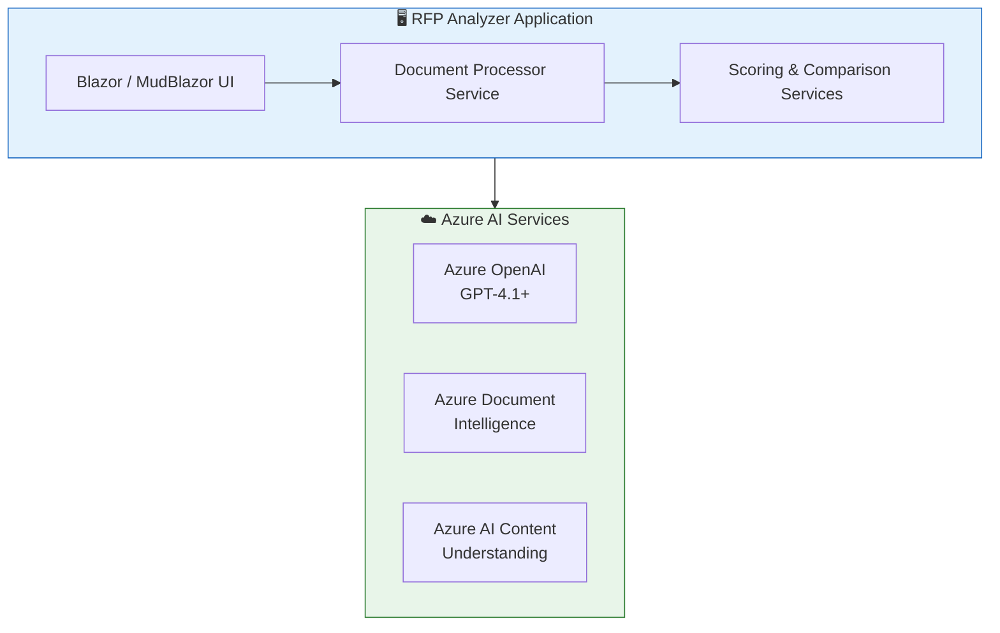

# RFP Analyzer

[](https://opensource.org/licenses/MIT)
[](https://dotnet.microsoft.com/)
[](https://azure.microsoft.com)

An AI-powered application for analyzing Request for Proposals (RFPs) and scoring vendor proposals using Azure AI services. Built with .NET 10 Blazor and MudBlazor.

## 🎯 Overview

RFP Analyzer automates the complex process of evaluating vendor proposals against RFP requirements. It leverages Azure AI services to extract document content, analyze evaluation criteria, and score proposals using specialized services.

### Key Capabilities

- **Automated Document Processing**: Extract content from PDFs, Word documents, and images using Azure AI
- **Intelligent Criteria Extraction**: Automatically identify evaluation criteria and weights from RFP documents
- **Multi-Vendor Comparison**: Evaluate and rank multiple vendor proposals simultaneously
- **Comprehensive Reporting**: Generate detailed reports in Excel, CSV, and JSON formats

## ✨ Features

### 3-Step Workflow

1. **📤 Upload Documents**
   - Upload your RFP document (PDF, DOCX, or images)
   - Upload multiple vendor proposals for comparison

2. **⚙️ Configure & Extract**
   - Choose extraction service (Azure Content Understanding or Document Intelligence)
   - Extract structured content from all documents

3. **🤖 AI-Powered Evaluation**
   - Automatic criteria extraction from RFP
   - Score each proposal against identified criteria
   - Generate comparative rankings and recommendations

### Document Extraction Services

| Service | Best For | Features |
|---------|----------|----------|
| **Azure Content Understanding** | Complex documents, mixed content | Multi-modal analysis, layout understanding |
| **Azure Document Intelligence** | Structured documents, forms | High accuracy OCR, pre-built models |

### Scoring & Comparison Services

| Service | Responsibility |
|---------|----------------|
| **ScoringService** | Analyzes RFP to extract criteria and scores each vendor proposal |
| **ComparisonService** | Compares vendors, generates rankings, and provides recommendations |

### Export Options

- 📊 **CSV Reports**: Comparison matrices with all metrics
- 📗 **Excel Documents**: Detailed evaluation reports per vendor
- 📋 **JSON Data**: Structured data for further processing
- 📈 **Interactive Charts**: Visual score comparisons via Plotly.Blazor

## 🏗️ Architecture

See [docs/ARCHITECTURE.md](docs/ARCHITECTURE.md) for detailed diagrams and component descriptions.

### High-Level Architecture



### Azure Resources (Deployed via `azd`)

| Resource | Purpose |
|----------|---------|
| **Azure AI Foundry Account** | Hosts AI services (OpenAI, Content Understanding, Document Intelligence) |
| **Azure Container Apps** | Runs the Blazor application |
| **Azure Container Registry** | Stores application container images |
| **Log Analytics Workspace** | Centralized logging and monitoring |
| **Application Insights** | Application performance monitoring |
| **User-Assigned Managed Identity** | Secure authentication to Azure services |

## 🚀 Getting Started

### Prerequisites

- **.NET 10 SDK** - [Download](https://dotnet.microsoft.com/download/dotnet/10.0)
- **Azure CLI** - [Install Azure CLI](https://docs.microsoft.com/cli/azure/install-azure-cli)
- **Azure Developer CLI (azd)** - [Install azd](https://learn.microsoft.com/azure/developer/azure-developer-cli/install-azd)
- **Docker** (optional) - For containerized deployment

### Azure Subscription Requirements

Your Azure subscription needs:
- Azure OpenAI access (with GPT-4.1 or GPT-5 model deployment)
- Azure AI Foundry resource
- Sufficient quota for model deployments

### Quick Start (Local Development)

1. **Clone the repository**
   ```bash
   git clone https://github.com/amgdy/rfp-analyzer.git
   cd rfp-analyzer
   ```

2. **Authenticate with Azure**
   ```bash
   az login
   ```

3. **Configure app settings**
   ```bash
   # Edit app/RfpAnalyzer/appsettings.Development.json with your Azure endpoints
   ```

4. **Build and run**
   ```bash
   cd app
   dotnet build
   dotnet run --project RfpAnalyzer
   ```

5. **Open your browser** at `https://localhost:5001` (or the URL shown in the console)

## ☁️ Azure Deployment

### Deploy with Azure Developer CLI

The easiest way to deploy is using Azure Developer CLI (`azd`):

1. **Initialize the environment**
   ```bash
   azd init
   ```

2. **Provision Azure resources and deploy**
   ```bash
   azd up
   ```
   
   This will:
   - Create a resource group
   - Provision all required Azure resources
   - Build and push the container image
   - Deploy the application to Azure Container Apps

3. **Access your application**
   
   After deployment, `azd` will output the application URL.

### What Gets Deployed

```
Resource Group: rg-{environment-name}
├── Azure AI Foundry Account
│   ├── GPT-5.2 Model Deployment
│   ├── GPT-4.1 Model Deployment
│   ├── GPT-4.1-mini Model Deployment
│   └── text-embedding-3-large Deployment
├── Azure AI Foundry Project
├── Azure Container Apps Environment
│   └── rfp-analyzer (Container App)
├── Azure Container Registry
├── Log Analytics Workspace
├── Application Insights
└── User-Assigned Managed Identity
```

### Environment Variables

The following environment variables are configured automatically during Azure deployment:

| Variable | Description |
|----------|-------------|
| `AZURE_OPENAI_ENDPOINT` | Azure OpenAI endpoint URL |
| `AZURE_OPENAI_DEPLOYMENT_NAME` | Default model deployment name |
| `AZURE_CONTENT_UNDERSTANDING_ENDPOINT` | Content Understanding endpoint |
| `AZURE_DOCUMENT_INTELLIGENCE_ENDPOINT` | Document Intelligence endpoint |
| `AZURE_CLIENT_ID` | Managed identity client ID |
| `APPLICATIONINSIGHTS_CONNECTION_STRING` | App Insights connection string |

### Manual Configuration (Local Development)

For local development, edit `app/RfpAnalyzer/appsettings.Development.json`:

```json
{
  "AzureOpenAI": {
    "Endpoint": "https://your-resource.openai.azure.com/",
    "DeploymentName": "gpt-4o-mini"
  },
  "AzureContentUnderstanding": {
    "Endpoint": "https://your-ai-foundry.services.ai.azure.com/"
  },
  "AzureDocumentIntelligence": {
    "Endpoint": "https://your-doc-intel.cognitiveservices.azure.com/"
  }
}
```

## 🐳 Docker Deployment

### Using Docker Directly

```bash
# Build the image from the repository root
docker build -t rfp-analyzer .

# Run the container
docker run -p 8501:8501 \
  -e AZURE_CONTENT_UNDERSTANDING_ENDPOINT=your-endpoint \
  -e AZURE_OPENAI_ENDPOINT=your-openai-endpoint \
  -e AZURE_OPENAI_DEPLOYMENT_NAME=gpt-4o-mini \
  -e AZURE_TENANT_ID=your-tenant-id \
  -e AZURE_CLIENT_ID=your-client-id \
  -e AZURE_CLIENT_SECRET=your-client-secret \
  rfp-analyzer
```

Access the application at `http://localhost:8501`

## 📁 Project Structure

```
rfp-analyzer/
├── README.md                          # This file
├── LICENSE                            # MIT License
├── azure.yaml                         # Azure Developer CLI configuration
├── docs/
│   └── ARCHITECTURE.md               # Detailed architecture documentation
├── app/
│   ├── Dockerfile                     # Multi-stage Docker build
│   ├── RfpAnalyzer.slnx              # Solution file
│   ├── global.json                   # .NET SDK version pinning
│   ├── RfpAnalyzer/                  # Main Blazor Web App project
│   │   ├── RfpAnalyzer.csproj       # Project file (net10.0)
│   │   ├── Program.cs               # Application entry point
│   │   ├── Components/
│   │   │   ├── App.razor            # Root component
│   │   │   ├── Routes.razor         # Routing configuration
│   │   │   ├── Layout/              # MainLayout, NavMenu
│   │   │   └── Pages/               # Upload, Extract, Evaluate pages
│   │   ├── Services/
│   │   │   ├── DocumentProcessorService.cs  # Document extraction orchestrator
│   │   │   ├── ScoringService.cs            # AI-powered proposal scoring
│   │   │   └── ComparisonService.cs         # Vendor comparison & ranking
│   │   ├── Models/                   # Data models (Scoring, Evaluation, etc.)
│   │   ├── Properties/              # Launch settings
│   │   └── wwwroot/                 # Static assets
│   └── tests/
│       └── RfpAnalyzer.Tests/       # Unit tests
└── infra/
    ├── main.bicep                    # Main infrastructure template
    ├── main.parameters.json          # Deployment parameters
    ├── resources.bicep               # Azure resource definitions
    ├── abbreviations.json            # Resource naming abbreviations
    ├── modules/
    │   └── fetch-container-image.bicep
    └── hooks/
        ├── postprovision.sh          # Post-deployment script (Linux/macOS)
        └── postprovision.ps1         # Post-deployment script (Windows)
```

## 🔧 Configuration

### Document Processing

Choose between extraction services in the application:
- **Azure Content Understanding**: Best for complex documents with mixed content
- **Azure Document Intelligence**: Best for structured documents and forms

### Model Selection

The application supports multiple Azure OpenAI models:
- **GPT-5.2**: Latest model with best performance
- **GPT-4.1**: Strong performance, widely available
- **GPT-4.1-mini**: Cost-effective for simpler tasks

## 📊 Usage Guide

### Step 1: Upload Documents

1. Upload your RFP document (PDF, DOCX, PNG, JPG)
2. Upload one or more vendor proposal documents
3. Each document will show a preview and file size

### Step 2: Extract Content

1. Select your preferred extraction service
2. Click "Extract All Documents"
3. Wait for processing (progress shown for each document)
4. Review extracted content in the expandable sections

### Step 3: Evaluate & Compare

1. Click "Start Evaluation" to begin AI analysis
2. The system will:
   - Extract evaluation criteria from the RFP
   - Score each vendor against the criteria
   - Generate a comparative ranking
3. Review results in the tabbed interface:
   - **Summary**: Overall rankings and recommendations
   - **Individual Reports**: Detailed scores per vendor
   - **Comparison Matrix**: Side-by-side criterion comparison

### Step 4: Export Results

Download results in your preferred format:
- **CSV**: For spreadsheet analysis
- **Excel**: For formal reporting
- **JSON**: For integration with other systems

## 🧪 Development

### Building

```bash
cd app
dotnet build
```

### Running Tests

```bash
cd app
dotnet test
```

### Local Development with Hot Reload

```bash
cd app
dotnet watch --project RfpAnalyzer
```

## 📦 Dependencies

### Core Dependencies

| Package | Purpose |
|---------|---------|
| `MudBlazor` | Material Design component library for Blazor |
| `Azure.Identity` | Azure authentication (DefaultAzureCredential) |
| `Azure.Core` | Azure SDK core library |
| `Plotly.Blazor` | Interactive charts |
| `ClosedXML` | Excel document generation |
| `CsvHelper` | CSV report generation |

## 🔒 Security

- **Managed Identity**: Azure resources use managed identity for secure, keyless authentication
- **No Stored Credentials**: Application uses `DefaultAzureCredential` for flexible authentication
- **Network Security**: Container Apps can be configured with private endpoints
- **RBAC**: Fine-grained role-based access control for Azure resources

## 🤝 Contributing

We welcome contributions! Please see [CONTRIBUTING.md](CONTRIBUTING.md) for guidelines.

1. Fork the repository
2. Create a feature branch (`git checkout -b feature/amazing-feature`)
3. Commit your changes (`git commit -m 'Add amazing feature'`)
4. Push to the branch (`git push origin feature/amazing-feature`)
5. Open a Pull Request

## 📄 License

This project is licensed under the MIT License - see the [LICENSE](LICENSE) file for details.

## 🙏 Acknowledgments

- [Azure AI Services](https://azure.microsoft.com/products/ai-services/) for powerful AI capabilities
- [MudBlazor](https://mudblazor.com/) for the Material Design component library
- [.NET Blazor](https://dotnet.microsoft.com/apps/aspnet/web-apps/blazor) for the interactive web framework

## 📞 Support

- **Issues**: [GitHub Issues](https://github.com/amgdy/rfp-analyzer/issues)
- **Discussions**: [GitHub Discussions](https://github.com/amgdy/rfp-analyzer/discussions)
- **Documentation**: [docs/](docs/)

---

**Built with ❤️ using .NET 10 and Azure AI Services**
