# RFP Analyzer Architecture

This document provides a comprehensive overview of the RFP Analyzer application architecture, including component diagrams, data flow, and Azure resource topology.

## Table of Contents

- [System Overview](#system-overview)
- [Application Architecture](#application-architecture)
- [Component Architecture](#component-architecture)
- [Multi-Agent System](#multi-agent-system)
- [Azure Infrastructure](#azure-infrastructure)
- [Data Flow](#data-flow)
- [Security Architecture](#security-architecture)

---

## System Overview

RFP Analyzer is a cloud-native application that leverages Azure AI services to automate the evaluation of vendor proposals against RFP requirements. The system uses a multi-agent architecture powered by Azure OpenAI to provide intelligent, consistent, and scalable proposal evaluation.

### Architecture Principles

- **Cloud-Native**: Designed for Azure Container Apps with managed scaling
- **Serverless AI**: Leverages Azure AI services without managing infrastructure
- **Secure by Default**: Uses managed identities and RBAC for authentication
- **Observable**: Integrated monitoring with Application Insights and Log Analytics

---

## Application Architecture

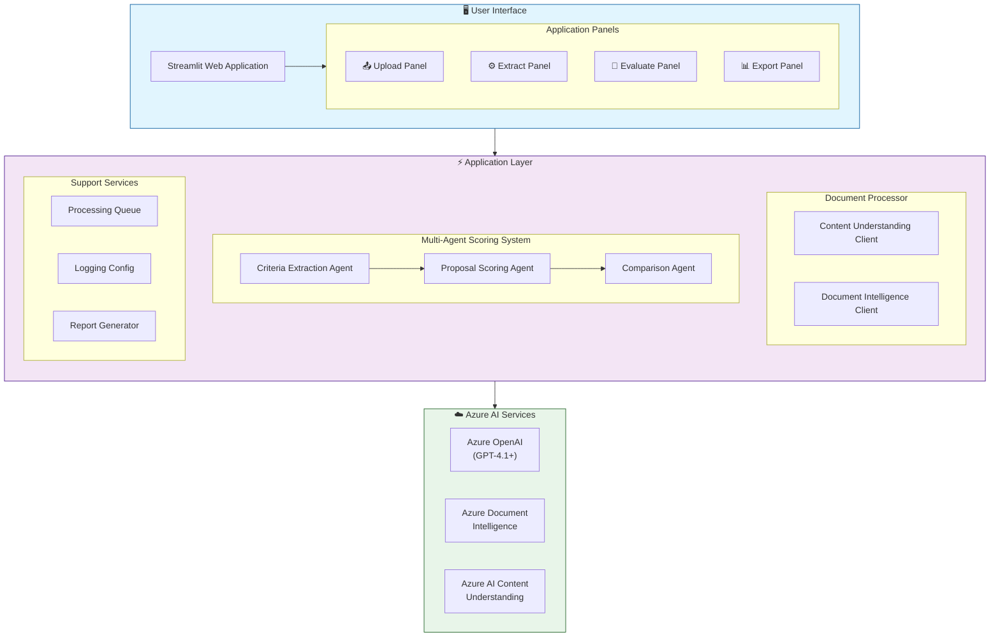

---

## Component Architecture

### Core Components

#### 1. Streamlit Web Application (`main.py`)

The main entry point providing an interactive web interface:

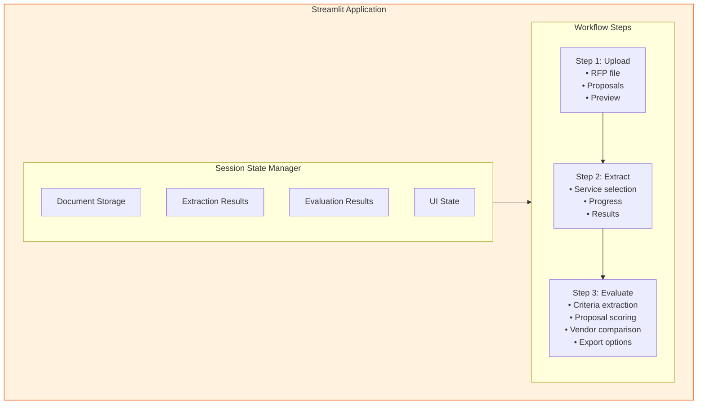

#### 2. Document Processor (`document_processor.py`)

Orchestrates document extraction across multiple Azure AI services:

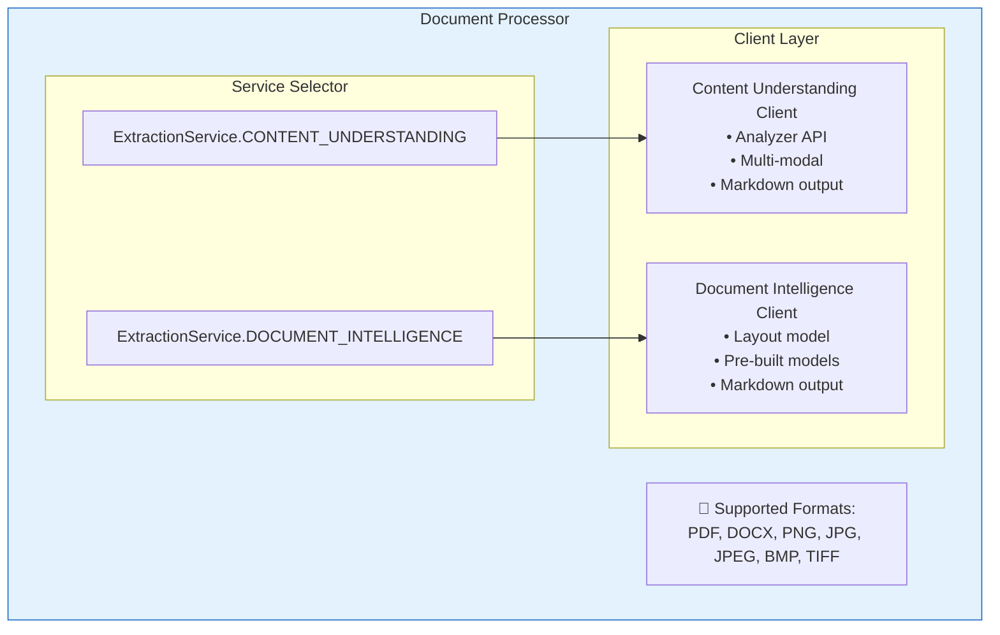

#### 3. Multi-Agent Scoring System (`scoring_agent_v2.py`)

Implements the AI-powered evaluation using specialized agents:

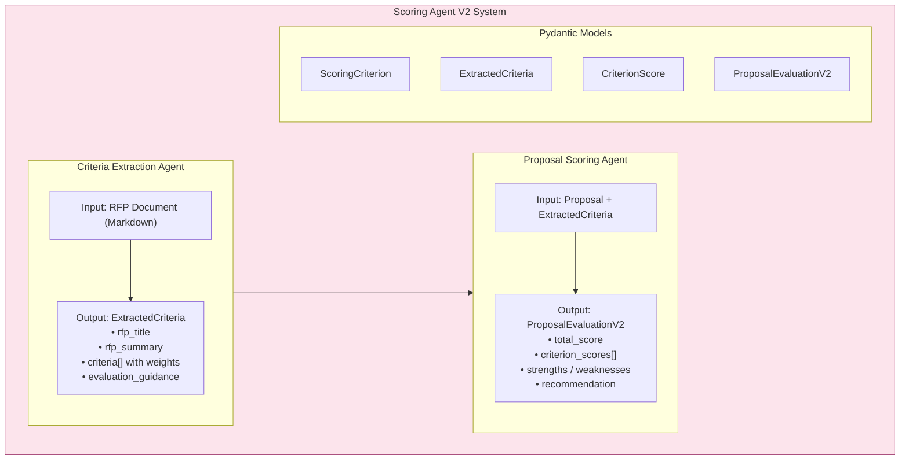

#### 4. Comparison Agent (`comparison_agent.py`)

Compares multiple vendor evaluations and generates comparative analysis:

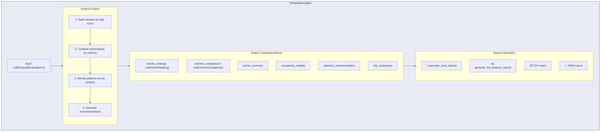

---

## Multi-Agent System

The evaluation pipeline uses a sequential multi-agent architecture:

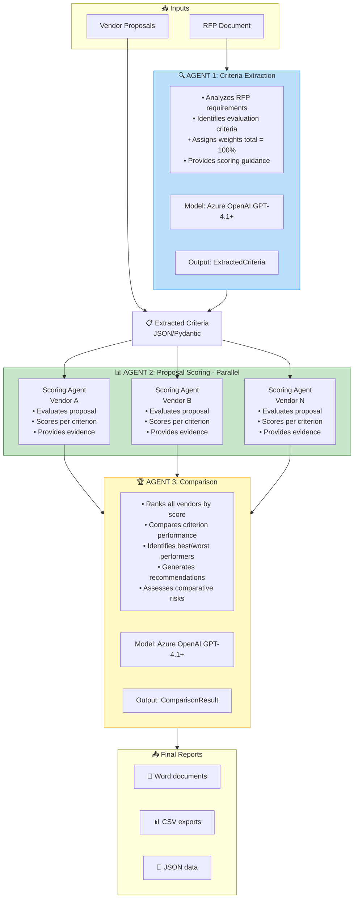

### Agent Communication Pattern

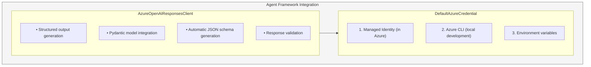

---

## Azure Infrastructure

### Resource Topology

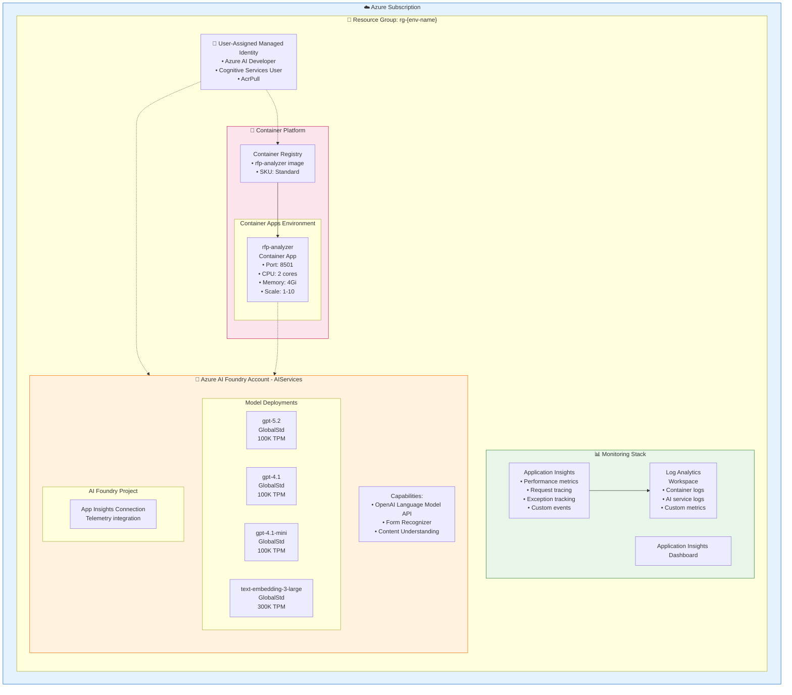

### Infrastructure as Code (Bicep)

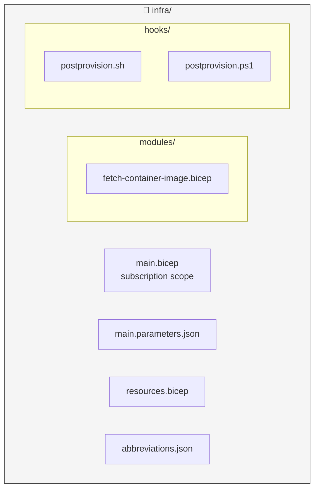

### Bicep Module Dependencies

```mermaid
flowchart TB
    Main["main.bicep<br>subscription scope"]
    
    Main --> RG["rfpResourceGroup<br>AVM module"]
    
    RG --> Resources["resources.bicep<br>resource group scope"]
    
    Resources --> Monitoring["monitoring<br>AVM pattern"]
    Resources --> Identity["rfpAnalyzerIdentity<br>AVM module"]
    Resources --> Foundry["foundryAccount<br>AVM module"]
    Resources --> Project["foundryProject<br>native resource"]
    Resources --> Registry["containerRegistry<br>AVM module"]
    Resources --> CAEnv["containerAppsEnvironment<br>AVM module"]
    Resources --> FetchImg["rfpAnalyzerFetchLatestImage<br>custom module"]
    Resources --> ContainerApp["rfpAnalyzer<br>AVM module"]
    Resources --> Roles["Role Assignments<br>AVM modules"]
    
    Monitoring --> LAW["Log Analytics Workspace"]
    Monitoring --> AppIns["Application Insights"]
    Monitoring --> Dash["Dashboard"]
    
    Identity --> UAMI["User-Assigned Managed Identity"]
    
    Foundry --> AIS["AIServices Account"]
    Foundry --> Deploy["Model Deployments"]
    
    Project --> AIC["App Insights Connection"]
    
    ContainerApp --> CA["Container App"]
    
    Roles --> R1["Azure AI Developer"]
    Roles --> R2["Cognitive Services User"]
    
    Main --> Outputs["Outputs"]
    Outputs --> O1["AZURE_CONTAINER_REGISTRY_ENDPOINT"]
    Outputs --> O2["AZURE_RESOURCE_RFP_ANALYZER_ID"]
    Outputs --> O3["AZURE_OPENAI_ENDPOINT"]
    Outputs --> O4["AZURE_DOCUMENT_INTELLIGENCE_ENDPOINT"]
    Outputs --> O5["AZURE_CONTENT_UNDERSTANDING_ENDPOINT"]
    
    style Main fill:#bbdefb,stroke:#1976d2
    style Resources fill:#c8e6c9,stroke:#388e3c
```

---

## Data Flow

### Document Processing Flow

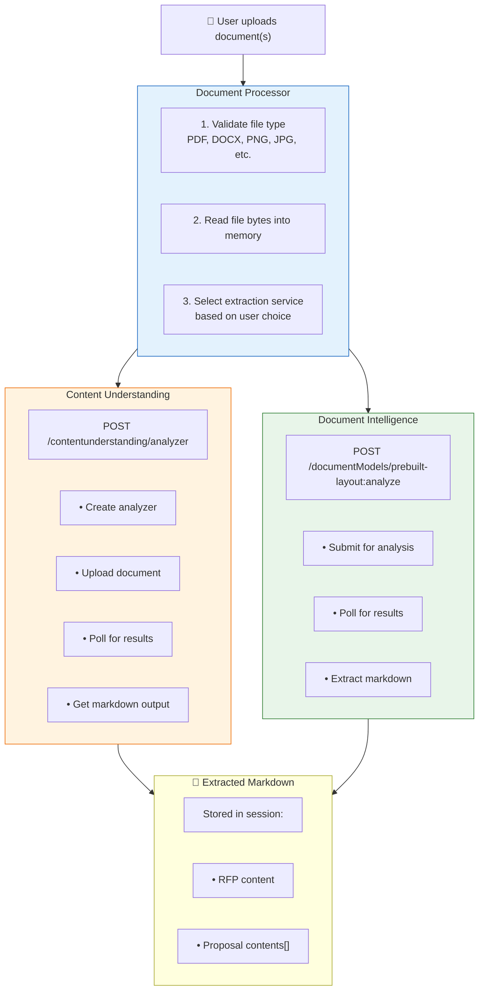

### Evaluation Pipeline Flow

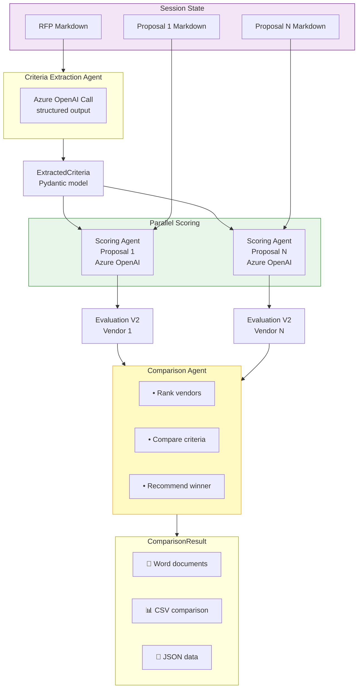

---

## Security Architecture

### Authentication Flow

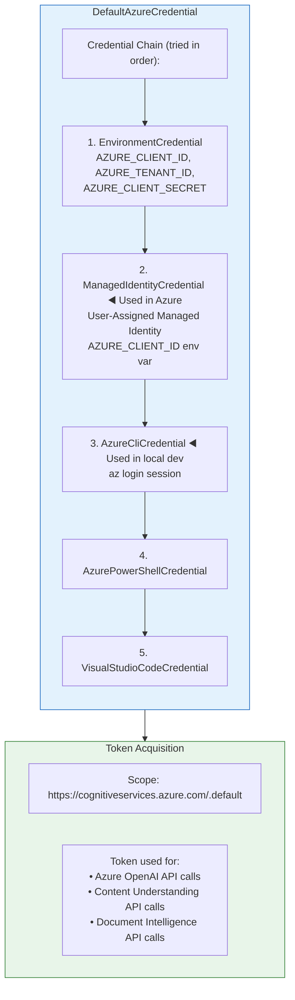

### RBAC Configuration

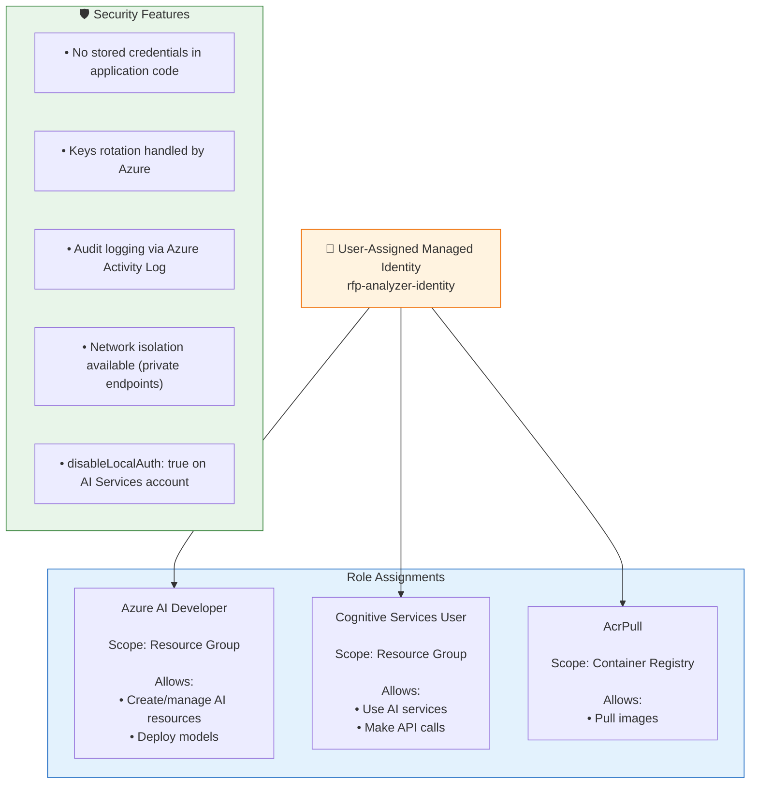

---

## Deployment Architecture

### Azure Developer CLI (azd) Workflow

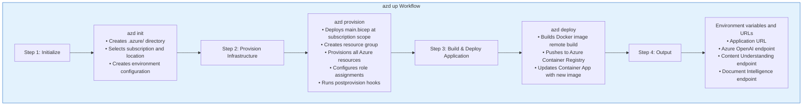

### Container Deployment

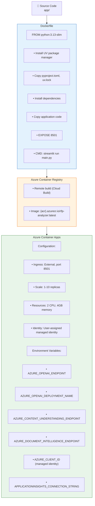

---

## Monitoring & Observability

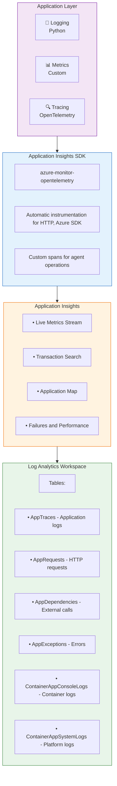

---

## Class Diagrams

### Pydantic Models

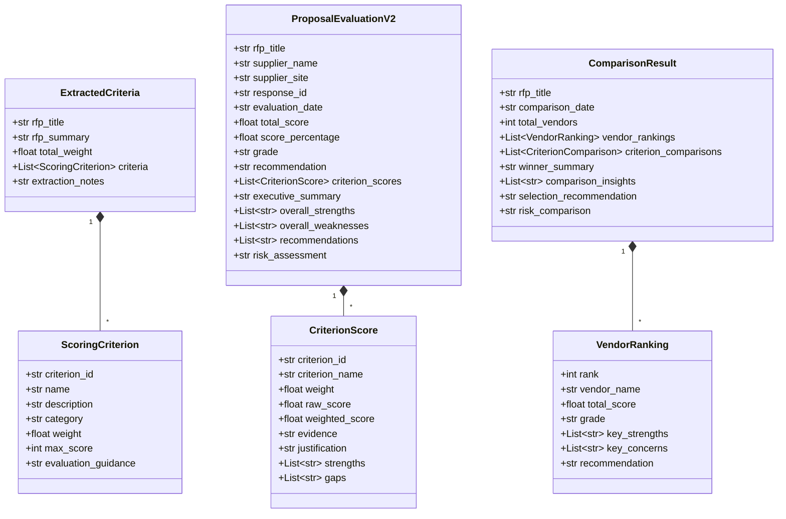

### Service Classes

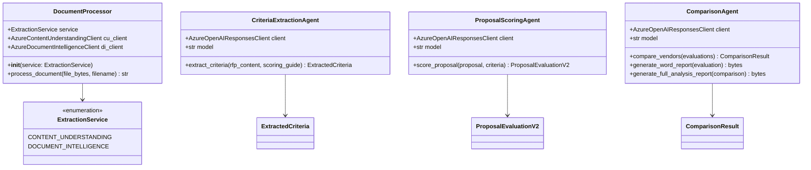

---

## Sequence Diagrams

### Full Evaluation Flow

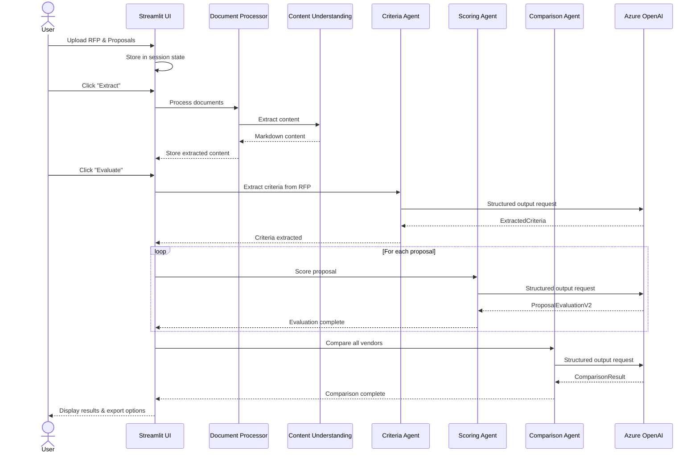

---

## Additional Resources

- [Azure AI Foundry Documentation](https://learn.microsoft.com/azure/ai-studio/)
- [Azure Container Apps Documentation](https://learn.microsoft.com/azure/container-apps/)
- [Azure Developer CLI Documentation](https://learn.microsoft.com/azure/developer/azure-developer-cli/)
- [Bicep Documentation](https://learn.microsoft.com/azure/azure-resource-manager/bicep/)
- [Streamlit Documentation](https://docs.streamlit.io/)
- [Microsoft Agent Framework](https://github.com/microsoft/agent-framework)
- [Mermaid Documentation](https://mermaid.js.org/)
